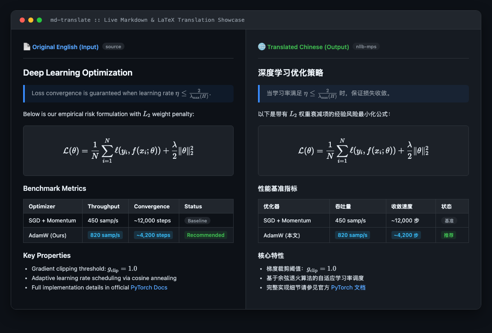

<p align="center">
  
</p>

<p align="center">
  <b>A zero-loss Markdown & LaTeX translation engine designed for local hardware acceleration (Apple Silicon / CUDA), CLI, CI/CD, and Autonomous AI Agents (MCP).</b>
</p>

<p align="center">
  <a href="LICENSE"></a>
  <a href="https://www.python.org/downloads/"></a>
  <a href="https://modelcontextprotocol.io/"></a>
  <a href="https://github.com/hugogu/md-translate/stargazers"></a>
  <a href="https://github.com/astral-sh/uv"></a>
</p>

<p align="center">
  <sub>Inspired by the scientific document translation pipeline of <a href="https://github.com/PDFMathTranslate/PDFMathTranslate">PDFMathTranslate</a>.</sub>
</p>

---

## 💡 Why md-translate?

Most automated translation tools treat Markdown files as simple plain text. When translated by standard models or external APIs, you inevitably encounter:
- ❌ **Destroyed LaTeX math**: Variable indices, symbols (`\alpha`, `\sum`), and sub/superscripts get scrambled.
- ❌ **Broken code blocks**: Code comments, identifiers, and indentations are mangled or partially translated.
- ❌ **Misaligned tables**: Border pipes (`|`) and alignments (`|:---|`) are stripped or distorted.
- ❌ **Agent Context Overflow**: Feeding entire technical documentation files directly into LLM chats explodes token costs and exceeds context windows.

**`md-translate` solves this completely.** It uses an AST-aware **`MarkdownProtector`** that extracts and isolates structural elements before translation, performs sentence-level neural translation on pure prose using **local hardware acceleration (M2/M3/M4 Max Metal MPS or Nvidia CUDA)**, and reassembles perfectly formatted Markdown with zero layout damage.

---

## 🖼️ Showcase & Examples

A side-by-side comparison illustrating how `md-translate` preserves LaTeX formulas, tables, blockquotes, and links with zero structural layout damage:

<p align="center">
  
</p>

> 💡 **Notice**: Inline formulas (`$\eta$`), display equations (`$$...$$`), table borders, alignments, and hyperlinked URLs are 100% identical and undamaged.

---

## ⚡ High-Speed Installation (with `uv` & `pip`)

We strongly recommend [`uv`](https://github.com/astral-sh/uv), the ultra-fast Python package installer.

### Method 1: Using `uv` (Recommended — 10x-100x Faster)

```bash
# Clone the repository
git clone https://github.com/hugogu/md-translate.git
cd md-translate

# Create a clean virtual environment & install md-translate
uv venv
source .venv/bin/activate

# Install core CLI with local Apple Silicon / CUDA acceleration
uv pip install -e ".[nllb]"

# If you want MCP server support for Claude / Cursor Agents:
uv pip install -e ".[mcp]"
```

### Method 2: Standard `pip`

```bash
python3 -m venv .venv
source .venv/bin/activate

# Install all features
pip install -e ".[all]"
```

---

## 🖥️ Hardware Acceleration & Environment Handling

`md-translate` auto-detects your platform and enables optimal hardware acceleration out of the box:

| Hardware Environment | Auto-Detected Device | Engine / Precision | Notes |
| :--- | :--- | :--- | :--- |
| **Apple Silicon (M1/M2/M3/M4 Max/Pro)** | `mps` (Metal Performance Shaders) | `float16` | **Zero config required**. Ultra-fast unified memory inference. |
| **Nvidia GPUs (Linux / Windows)** | `cuda` | `float16` / `bfloat16` | Requires CUDA PyTorch. High-throughput batch processing. |
| **CPU / GitHub Actions Runners** | `cpu` | `int8` (CTranslate2) or `float32` | Ideal for CI/CD environments with zero GPU availability. |

---

## 🚀 Usage

### 1. Command-Line (CLI)

```bash
# 1. Translate a single document
md-translate README.md -o README.zh.md --from en --to zh

# 2. Batch translate an entire knowledge base / directory recursively
md-translate ./docs -o ./docs_zh --from en --to zh --recursive

# 3. Dry-run test (verify markdown preservation without downloading model weights)
md-translate docs/guide.md -o docs/guide.test.md --engine echo
```

---

### 2. Model Context Protocol (MCP) for AI Agents

`md-translate` provides a native **Zero-Copy / Claim-Check** MCP server.  
Instead of pushing megabytes of raw Markdown text through the agent's context window, the Agent merely hands off the local file paths. The translation executes directly on your local GPU/Metal unified memory and writes to the destination path.

#### Add to your Claude Desktop or Cursor configuration (`claude_desktop_config.json`):

```json
{
  "mcpServers": {
    "md-translate": {
      "command": "python3",
      "args": ["-m", "md_translate.mcp_server"]
    }
  }
}
```

#### How the Agent calls it:
```json
{
  "tool": "translate_markdown_file",
  "arguments": {
    "input_file_path": "/Users/gqq/kb/architecture.md",
    "output_file_path": "/Users/gqq/kb/architecture_zh.md",
    "engine": "nllb",
    "src_lang": "en",
    "tgt_lang": "zh"
  }
}
```
> **Result**: Consumes fewer than 50 tokens per page, enabling autonomous agents to translate entire libraries of documentation without context truncation or rate-limit penalties.

---

### 3. Python API

```python
from md_translate import translate_markdown, translate_file

# In-memory translation
doc = "# Overview\n\nEuler's identity: $e^{i\\pi} + 1 = 0$ is elegant."
translated = translate_markdown(doc, translator="nllb", src_lang="en", tgt_lang="zh")
print(translated)

# File-to-file translation
translate_file("input.md", "output.zh.md", translator="nllb", src_lang="en", tgt_lang="zh")
```

---

## 🧩 Architecture

```
                          ┌────────────────────────┐
                          │   Raw Markdown Document│
                          └───────────┬────────────┘
                                      │
                         [MarkdownProtector]
                 (Extract Math, Code, Tables, URLs)
                                      │
                     ┌────────────────┴───────────────┐
                     │                                │
             Protected Sentinels               Pure Prose Slices
          (Invisible U+2063 Shields)            (Sentence Split)
                     │                                │
                     │                 [Translation Engine]
                     │                 (NLLB on M2 MPS / CT2 / LLM)
                     │                                │
                     └────────────────┬───────────────┘
                                      │
                             [Restore & Assemble]
                                      │
                          ┌───────────▼────────────┐
                          │ Well-Formed Markdown   │
                          └────────────────────────┘
```

---

## 🗺️ Roadmap

- [x] Strict formula, table, link, and code block preservation
- [x] Apple Silicon Metal (MPS) and Nvidia CUDA hardware acceleration
- [x] Zero-Copy / Claim-Check Model Context Protocol (MCP) server
- [x] Recursive batch CLI translation
- [ ] **Multi-language Code Comments Translation** (Translate comments inside `#`, `//`, `/* */` while keeping syntax intact)
- [ ] **HTML & Web Documentation Translation** (Direct translation support for `.html` files & Sphinx/Docusaurus docs)
- [ ] Translation caching via SHA-256 diffing (re-translate only modified paragraphs)
- [ ] Interactive Web UI / Electron companion desktop app
- [ ] Support for custom glossaries and technical terminology dictionaries

---

## 🤝 Contributing

Contributions are warmly welcomed! Please read [CONTRIBUTING.md](CONTRIBUTING.md) to get started.

```bash
# Run tests locally
python3 -c "import sys; sys.path.insert(0, 'src'); from tests.test_translation import test_markdown_protector_integrity, test_full_pipeline_with_echo_engine; test_markdown_protector_integrity(); test_full_pipeline_with_echo_engine(); print('PASS')"
```

---

## 📄 License

This project is licensed under the [MIT License](LICENSE). Free for personal, academic, and commercial use.
